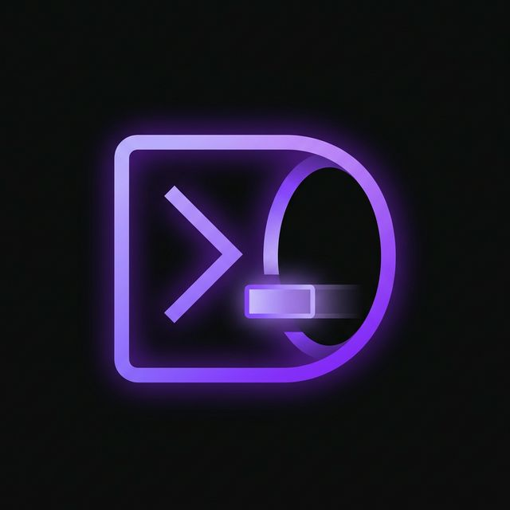

<p align="center">
  
  <h1 align="center">ShellPort</h1>
  <p align="center">
    <strong>Encrypted terminal-over-the-web in a single binary.</strong><br>
    Zero dependencies · E2E AES-256-GCM · Built-in canvas terminal · Tailscale ready
  </p>
  <p align="center">
    <a href="#install"></a>
    <a href="https://www.npmjs.com/package/shellport"></a>
    <a href="./LICENSE"></a>
    <a href="https://bun.sh"></a>
  </p>
</p>

---

Share your shell over the network with **end-to-end AES-256-GCM encryption**, a **custom canvas terminal emulator**, and **multi-session tabs** — all packed into one file powered by [Bun](https://bun.sh). No xterm.js. No node_modules. No config files.

```bash
shellport server
```

Then open `http://localhost:7681/#your-secret-here` in your browser. That's it.

## Why ShellPort?

Most web terminal tools either force you to haul in xterm.js + a Node.js runtime, or sacrifice encryption entirely. ShellPort takes a different approach:

| Problem | ShellPort's Answer |
|---|---|
| Heavy frontend deps (xterm.js, hterm) | **NanoTermV2** — custom Canvas2D renderer, ~50 KB, zero deps |
| No built-in encryption | **E2E AES-256-GCM** with PBKDF2 key derivation (100K iterations) |
| Complex setup | **Single command** — `bunx shellport server` |
| Multiple services needed | **One binary** — HTTP server, WebSocket, PTY, and frontend all included |
| Can't share publicly | **Tailscale integration** — one flag for public HTTPS (requires Tailscale CLI) |

---

## Features

## Security

- **Encrypted by default** — a random session secret is generated on each server launch
- All traffic is encrypted with **AES-256-GCM** (disable explicitly with `--no-secret`)
- Key derivation uses **PBKDF2** (100,000 iterations, SHA-256)
- The encryption secret is passed via URL fragment (`#secret`), which is **never sent to the server**
- **Authentication**: Clients must prove knowledge of the key before a shell is spawned
- **Session limits**: Maximum 10 concurrent PTY sessions (prevents resource exhaustion)
- **Origin validation**: WebSocket upgrades are validated to prevent cross-site hijacking
- **Environment isolation**: Only safe environment variables (`HOME`, `PATH`, etc.) are forwarded to PTY sessions
- No telemetry, no analytics, no network calls

> ⚠️ **Fixed passwords are not recommended.** The default auto-generated secret provides better security since it changes every session, preventing credential reuse. Use `--secret` only when you need to share a pre-arranged key with remote clients.

### Known Limitations

- PBKDF2 uses a static, application-wide salt. Users who choose the same fixed password will derive the same key. This is another reason to prefer auto-generated secrets.
- The secret is visible in `ps` output when passed via `--secret`. Use the `SHELLPORT_SECRET` environment variable instead.

### 🖥️ NanoTermV2 — Canvas Terminal Emulator
- **Canvas2D** hardware-accelerated rendering (no DOM nodes)
- VT100 / VT220 / xterm escape sequence parsing
- 256-color + **truecolor** (24-bit) support
- Alternate screen buffer (vim, htop, tmux)
- Text selection with clipboard integration
- Mouse tracking (X10, Normal, SGR modes)
- Bracketed paste mode
- UTF-8 streaming decoder
- **~50 KB** — usable as a standalone library

### 📡 Server & Connectivity
- Native **Bun PTY** API — true terminal, zero-latency
- WebSocket binary framing with sequenced message ordering
- Multi-session support with **tmux-style sidebar tabs**
- Terminal resize forwarding
- **Tailscale** integration — `serve` or `funnel` in one flag
- CLI client for terminal-to-terminal connections

### 📦 Zero Friction
- **Zero runtime dependencies** — only `@types/bun` for development
- Cross-compiled single binaries for Linux, macOS, and Windows
- ~2,400 lines of TypeScript + JavaScript total

---

## Install

### Quick Start (requires Bun)

```bash
bunx shellport server
```

### Prebuilt Binary

Download from [GitHub Releases](https://github.com/igorls/shellport/releases):

```bash
curl -fsSL https://github.com/igorls/shellport/releases/latest/download/shellport-linux-x64 -o shellport
chmod +x shellport
./shellport server
```

### From Source

```bash
git clone https://github.com/igorls/shellport.git
cd shellport
bun install
bun run dev          # Run locally
bun run build        # Build single binary (current platform)
bun run build:binaries  # Cross-compile all platforms
```

---

## Usage

### Server

```bash
# Start with auto-generated secret (recommended)
shellport server
# → Prints: 🔑 Secure access: http://localhost:7681/#<random-secret>

# Fixed secret (not recommended — prefer auto-generated)
shellport server --secret your-secret-here

# Plaintext mode (trusted network only)
shellport server --no-secret

# Custom port
shellport server --port 8080

# Public via Tailscale Funnel
shellport server --tailscale funnel
```

The server prints the full URL with the secret — just open it in your browser.

### CLI Client

Connect from another machine's terminal:

```bash
shellport client ws://host:7681/ws --secret your-secret-here
```

### Options

| Option | Description | Default |
|---|---|---|
| `--port, -p` | Server port | `7681` |
| `--secret, -s` | Fixed encryption secret | *(auto-generated)* |
| `--no-secret` | Disable encryption (plaintext) | *(off)* |
| `--tailscale` | `serve` or `funnel` | *(disabled)* |

#### Environment Variables

| Variable | Description |
|---|---|
| `SHELLPORT_SECRET` | E2E encryption key (avoids exposing secret in `ps`) |

---

## NanoTermV2 — Standalone Library

The canvas terminal emulator can be used independently in any web project:

```html
<script src="https://unpkg.com/shellport/src/frontend/nanoterm.js"></script>
<script>
  const term = new NanoTermV2(document.getElementById('terminal'), data => {
    ws.send(data); // Handle user input
  });

  term.write('Hello, world!\r\n');
</script>
```

Or via module import:

```js
import "shellport/nanoterm";

const term = new NanoTermV2(container, sendFn, {
  fontSize: 14,
  fontFamily: "'JetBrains Mono', monospace",
  cursorStyle: 'block',    // 'block' | 'underline' | 'bar'
  cursorBlink: true,
  scrollback: 10000,
  theme: {
    background: '#0a0a0a',
    foreground: '#e0e0e0',
    cursor: '#a78bfa',
  }
});
```

---

## Comparison with Alternatives

> How does ShellPort stack up against other terminal-sharing tools?

### Core

| | ShellPort | ttyd | GoTTY | sshx | tmate | Upterm |
|:--|:--:|:--:|:--:|:--:|:--:|:--:|
| **E2E Encryption** | ✅ AES-256 | ❌ | ❌ | ✅ Argon2 | ✅ SSH | ✅ SSH |
| **Web UI** | ✅ | ✅ | ✅ | ✅ | ✅ | ❌ |
| **Multi-Session** | ✅ | ❌ | ❌ | ✅ | ✅ | ❌ |
| **CLI Client** | ✅ | ❌ | ❌ | ❌ | ✅ | ✅ |
| **Zero Deps** | ✅ | ❌ | ✅ | ❌ | ❌ | ✅ |
| **Single Binary** | ✅ | ✅ | ✅ | ✅ | ❌ | ✅ |

### Extras

| | ShellPort | ttyd | GoTTY | sshx | tmate | Upterm |
|:--|:--:|:--:|:--:|:--:|:--:|:--:|
| **Collaboration** | — | — | — | ✅ Live cursors | ✅ Shared | ✅ Shared |
| **File Transfer** | — | ✅ ZMODEM | — | — | — | ✅ SFTP |
| **NAT Traversal** | ✅ Tailscale | — | — | ✅ Relay | ✅ Relay | ✅ Rev. SSH |
| **Language** | TS (Bun) | C | Go | Rust | C | Go |
| **Terminal** | Canvas2D | xterm.js | hterm | WASM | tmux | SSH |
| **Active** | ✅ | ✅ | ⚠️ | ✅ | ✅ | ⚠️ |

### When to pick what

- **ShellPort** — You want encrypted terminal sharing with the smallest footprint and zero dependencies. Great for DevOps, SSH-less remote access, and embedding a terminal in your own app via NanoTermV2.
- **ttyd** — You need a battle-tested, high-performance web terminal with file transfer support. Best for kiosk/dashboard terminals.
- **sshx** — You need real-time collaboration with multiple people (live cursors, chat). Best for pair programming and live demos.
- **tmate** — You need instant tmux-style session sharing with SSH clients. Best for pair debugging when both parties use a terminal.
- **Upterm** — You need SSH-based session sharing that works behind NATs. Best for CI/CD debugging and remote pairing.
- **Wetty** — You need a web frontend to an existing SSH server. Best for web-based SSH access to existing infrastructure.

---

## Architecture

```
src/
├── index.ts          # CLI entry — argument parsing & routing
├── server.ts         # HTTP + WebSocket + PTY server (Bun.serve)
├── client.ts         # CLI WebSocket client (raw terminal mode)
├── crypto.ts         # AES-256-GCM engine (PBKDF2 key derivation)
├── types.ts          # TypeScript types, constants, SeqQueue
└── frontend/
    ├── index.html    # HTML shell
    ├── styles.css    # Terminal + sidebar UI styles
    ├── nanoterm.js   # Canvas terminal emulator (standalone library)
    ├── app.js        # Session manager & UI logic
    └── build.ts      # HTML assembler (inlines all assets)
```

### Data Flow

```
Browser                          Server
  │                                │
  │  WebSocket (binary frames)     │
  │──────────────────────────────▶│
  │  [iv(12)][AES-GCM ciphertext] │
  │                                │──▶ PTY (shell process)
  │◀──────────────────────────────│
  │  [iv(12)][AES-GCM ciphertext] │
  │                                │
  └── URL fragment #secret         │
      (never leaves the browser)   │
```

---

## Security Model

| Layer | Mechanism |
|---|---|
| **Default Mode** | Random secret auto-generated per session |
| **Key Derivation** | PBKDF2 · 100,000 iterations · SHA-256 |
| **Encryption** | AES-256-GCM (authenticated encryption) |
| **IV** | 12-byte random nonce per message |
| **Authentication** | First frame must decrypt successfully to spawn PTY |
| **Secret Transport** | URL fragment (`#secret`) — not sent in HTTP requests |
| **Session Cap** | Max 10 concurrent PTY sessions |
| **Plaintext Mode** | Available with `--no-secret` (for localhost / VPN) |

> ⚠️ ShellPort is designed for **private terminal access**, not multi-tenant hosting. Prefer the default auto-generated secret. Use `--no-secret` only on trusted networks.

---

## Contributing

```bash
bun install          # Install dev dependencies
bun run dev          # Start dev server
bun test             # Run tests
bun run typecheck    # TypeScript check
```

---

## License

MIT — see [LICENSE](./LICENSE)
